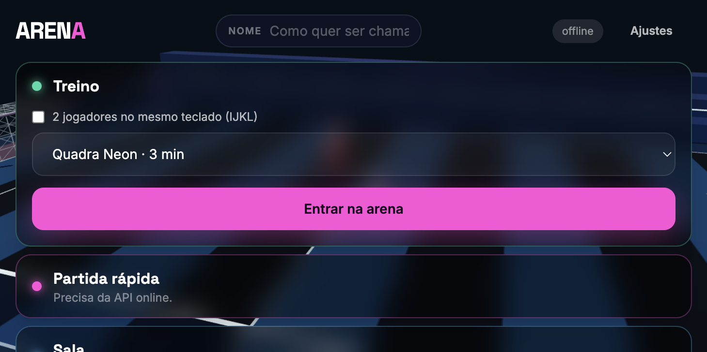
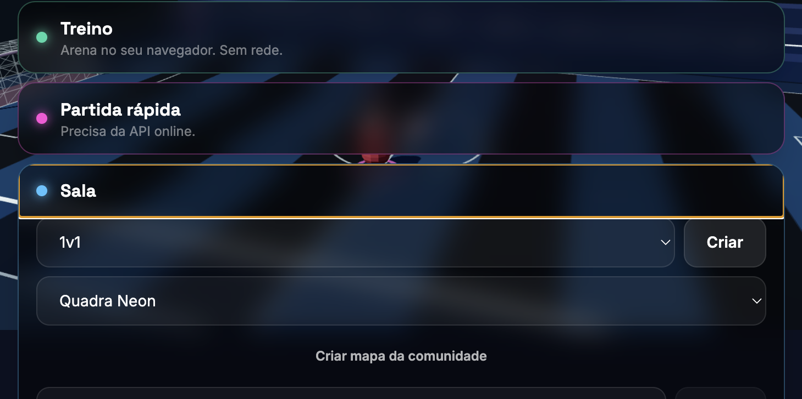
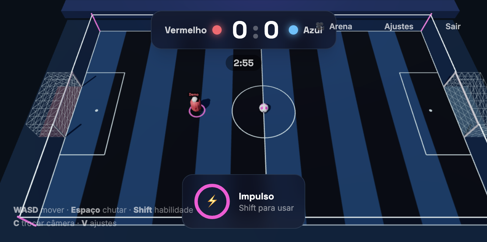
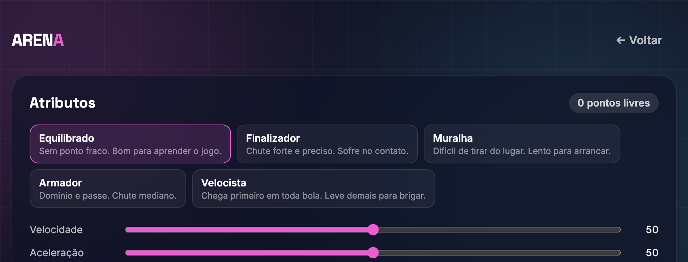

# Arena

Futebol arcade 3D multiplayer para navegador — inspirado no ritmo do HaxBall, com física 3D, habilidades e partidas online em tempo real.

## Prints

### Menu principal



### Sala



### Partida



### Loadout



## Como funciona

O jogo é um monorepo. A ideia central é que **a mesma simulação** (`@arena/sim`) roda no servidor (autoridade) e no cliente (previsão local). Assim, a sensação de controle permanece fluida mesmo com latência.

### Fluxo de uma partida online

1. O jogador abre o cliente (React + Three.js) e escolhe treino, sala privada ou fila.
2. O cliente conecta ao **game server** via WebSocket.
3. Lobby usa mensagens JSON (criar/entrar, time, ready, start).
4. Em jogo, o tráfego vira **binário**: inputs do jogador e snapshots do estado.
5. O servidor avança a física em **ticks fixos a 60 Hz**, aplica inputs e emite snapshots (~30 Hz).
6. O cliente prevê o jogador local e a bola, interpola os demais a partir dos snapshots e reconcilia com o estado autoritativo.


### Modos


| Modo              | O que faz                                                           |
| ----------------- | ------------------------------------------------------------------- |
| **Treino**        | Partida local na aba (`LocalHost`). Sem rede.                       |
| **Sala**          | Cria ou entra com código. Host inicia a partida.                    |
| **Ranked / fila** | Matchmaking via API (quando disponível); o servidor inicia sozinho. |


### Simulação compartilhada

`MatchSimulation` é a autoridade das regras: movimento, chute, gols, cronômetro, fases (`lobby` → `countdown` → `playing` → `goal` → `finished`) e habilidades. Não sabe se está no servidor, no cliente ou num teste.

Física com **Rapier3D** (colisões, bola, cápsulas de jogador, arena). Constantes de “feeling” ficam em `packages/sim/src/config/tuning.ts` e valem para cliente e servidor.

### Rede

Protocolo em `@arena/protocol`:

- **Texto (JSON):** lobby e controle de sala.
- **Binário:** `INPUT`, `SNAPSHOT`, `PING`/`PONG`.
- Inputs com redundância (últimos frames reenviados).
- Reconexão na mesma vaga por ~15 s.


### Habilidades e atributos

Cada jogador tem um loadout:

- **Atributos** (0–100, orçamento total): speed, acceleration, strength, control, power, precision, resilience, recharge.
- **Habilidades:** Dash (impulso), Power Shot (chute carregado), Shield (massa aumentada).


### Rulesets e arenas


| Ruleset    | Jogadores    | Arena       |
| ---------- | ------------ | ----------- |
| `duel`     | 1v1          | Quadra Neon |
| `doubles`  | 2v2          | Quadra Neon |
| `trios`    | 3v3          | Rooftop     |
| `squads`   | 4v4          | Rooftop     |
| `practice` | treino local | Quadra Neon |


## Estrutura do monorepo

```
arena/
├── apps/
│   ├── client/        # Frontend: React, Three.js, Vite
│   ├── game-server/   # Servidor de partidas (WebSocket + loop 60 Hz)
│   └── api/           # Plataforma (auth, persistência, matchmaking)
├── packages/
│   ├── sim/           # Simulação determinística + Rapier
│   └── protocol/      # Mensagens JSON e codec binário
└── package.json
```


| Pacote               | Papel                                             |
| -------------------- | ------------------------------------------------- |
| `@arena/client`      | UI, render 3D, coleta de input, host local/remoto |
| `@arena/game-server` | Salas, sessions, tick loop, snapshots             |
| `@arena/api`         | JWT, Postgres/PGlite, stats, histórico, fila      |
| `@arena/sim`         | Física, regras, abilities, arenas, rulesets       |
| `@arena/protocol`    | Contratos de rede e serialização                  |


## Tecnologias


### Cliente

- **React 19** — telas e HUD
- **Three.js** — arena, jogadores, bola, câmera, VFX
- **Vite 7** — bundler e dev server
- **Tailwind CSS 4** — estilo da UI
- **TypeScript**


### Simulação e rede

- **Rapier3D** (`@dimforge/rapier3d-compat`) — física
- **WebSocket (**`ws`**)** — servidor de jogo
- Protocolo próprio (JSON + binário)


### Plataforma (API)

- **Hono** — HTTP
- **Drizzle ORM** — schema e migrations
- **PostgreSQL** ou **PGlite** (Postgres embarcado em dev)
- **Redis** (opcional) — fila / registro de servidores
- **Jose** — JWT
- **Zod** — validação
- **Pino** — logs


### Ferramentas

- **pnpm** workspaces
- **Vitest** — testes (`sim`, `protocol`, `game-server`, `api`)
- **ESLint** + TypeScript


## Como rodar


### Pré-requisitos

- Node.js 20+
- [pnpm](https://pnpm.io/) 11+


### Instalação

```bash
pnpm install
```


### Desenvolvimento (cliente + game server)

```bash
pnpm dev
```

- Cliente: [http://localhost:5173](http://localhost:5173)  
- Game server: `ws://localhost:8080` (HTTP na mesma porta)


### Tudo em paralelo (inclui API)

```bash
pnpm dev:all
```

A API sobe em [http://localhost:8787](http://localhost:8787). Sem `DATABASE_URL` usa PGlite; sem `REDIS_URL` usa memória.

### Outros scripts

```bash
pnpm build      # build de todos os pacotes
pnpm test       # testes
pnpm typecheck  # checagem de tipos
pnpm lint       # ESLint
```


### Variáveis úteis (game server)


| Variável     | Padrão                 | Descrição                        |
| ------------ | ---------------------- | -------------------------------- |
| `PORT`       | `8080`                 | Porta HTTP/WS                    |
| `ALLOW_ANON` | `true`                 | Aceita convidados sem JWT        |
| `API_URL`    | *(vazio)*              | URL da API; vazio = modo isolado |
| `JWT_SECRET` | `dev-secret-change-me` | Segredo JWT                      |
| `MAX_ROOMS`  | `24`                   | Capacidade de salas              |


## Controles (padrão)

- **WASD** (ou setas) — movimento
- **Espaço / clique** — chute
- **Shift / tecla de habilidade** — ability do loadout

Há suporte a dois jogadores no mesmo teclado no modo treino.

## Arquitetura em uma frase

> Cliente renderiza e prevê; servidor simula e manda snapshots; `@arena/sim` é a fonte única das regras.


## Status

Projeto em desenvolvimento ativo (v0.1.0). O núcleo de simulação, protocolo e game server estão utilizáveis; a API de plataforma cobre auth/schema/stats e segue evoluindo junto com matchmaking e persistência de partidas.